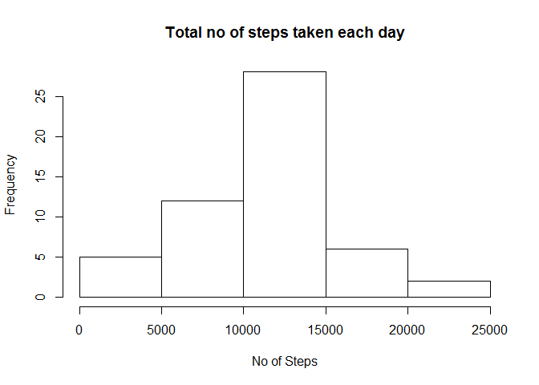
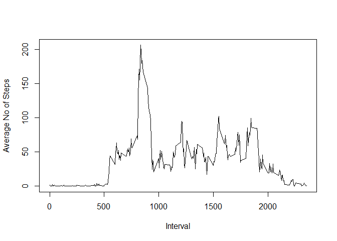
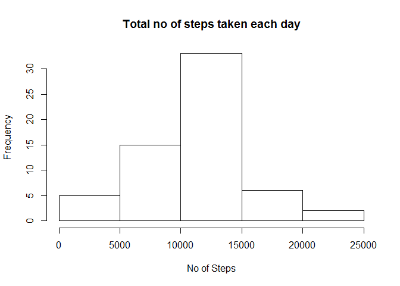
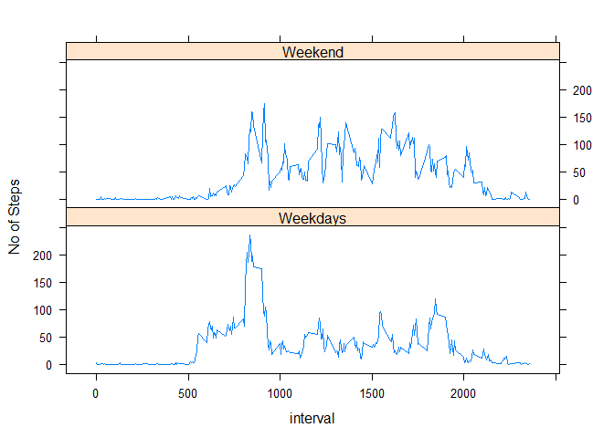

# Reproducible Research: Peer Assessment 1


## Loading and preprocessing the data

```r
setwd("C:/Users/user/Desktop/R/Course 5/RepData_PeerAssessment1")
data<- read.csv(file = "activity.csv")
data.rm.na<- subset(x = data, !is.na(data$steps))
sum.steps<- aggregate(x = data.rm.na$steps, by = list(date = data.rm.na$date), FUN = sum)
```


## What is mean total number of steps taken per day?
Histogram of steps taken each day

```r
hist(x = sum.steps$x, main="Total no of steps taken each day", xlab = "No of Steps")
```

 

```r
#Mean
as.numeric(mean(sum.steps$x))
```

```
## [1] 10766.19
```

```r
#Median
as.numeric(quantile(sum.steps$x, 0.5))
```

```
## [1] 10765
```

## What is the average daily activity pattern?

```r
mean.steps.interval<- aggregate(x=data.rm.na$steps, by = list(interval = data.rm.na$interval), FUN = mean)
plot(x = mean.steps.interval$interval, y = mean.steps.interval$x , type = "l", 
     ylab = "Average No of Steps", xlab = "Interval")
```

 

```r
#Interval with the max no of steps
mean.steps.interval[ mean.steps.interval$x == max(mean.steps.interval$x), 1]
```

```
## [1] 835
```


## Imputing missing values

```r
data.na<- data[is.na(data$steps), ]
data.na$date<- as.Date(data.na$date)
data.rm.na$date<- as.Date(data.rm.na$date)

agg.by.days<- aggregate(x= data.rm.na$steps, by = list(interval = data.rm.na$interval, 
        days = format(data.rm.na$date, format = "%A")), FUN = mean)
data.na$formatedDate<- format(data.na$date, format = "%A")
data.merge<- merge(x= data.na, y= agg.by.days, by.x = c("formatedDate", "interval"), 
                   by.y = c("days", "interval"))
names(data.merge)[names(data.merge) == "steps"] <- "_steps"
names(data.merge)[names(data.merge) == "x"] <- "steps"

combine<- rbind(data.rm.na, data.merge[, c(5, 4, 2)])
combine.sum.steps<- aggregate(x = combine$steps, by = list(date = combine$date), FUN = sum)

combine.mean.steps<- aggregate(x = combine$steps, by = list(date = combine$date), FUN = mean)

hist(x = combine.sum.steps$x, main="Total no of steps taken each day", xlab = "No of Steps")
```

 

```r
#Mean no of steps
combine.mean<- mean(combine.sum.steps$x)
#Median no of steps
combine.median<- quantile(combine.sum.steps$x, 0.5)
```

## Are there differences in activity patterns between weekdays and weekends?

```r
combine$Day<- weekdays(combine$date)
i<- 1

while (i<= nrow(combine))
{
    combine$Day[i] <- ifelse(combine$Day[i] == "Saturday" || combine$Day[i] == "Sunday", "Weekend", "Weekdays")
    i<- i+1
}

library(lattice)
combine$Day<- factor(combine$Day)

combineDay<- aggregate(x = combine$steps, by = list(day = combine$Day, interval = combine$interval), FUN = mean )
summary(combine)
```

```
##      steps             date               interval            Day       
##  Min.   :  0.00   Min.   :2012-10-01   Min.   :   0.0   Weekdays:12960  
##  1st Qu.:  0.00   1st Qu.:2012-10-16   1st Qu.: 588.8   Weekend : 4608  
##  Median :  0.00   Median :2012-10-31   Median :1177.5                   
##  Mean   : 37.57   Mean   :2012-10-31   Mean   :1177.5                   
##  3rd Qu.: 19.04   3rd Qu.:2012-11-15   3rd Qu.:1766.2                   
##  Max.   :806.00   Max.   :2012-11-30   Max.   :2355.0
```

```r
summary(combineDay)
```

```
##        day         interval            x          
##  Weekdays:288   Min.   :   0.0   Min.   :  0.000  
##  Weekend :288   1st Qu.: 588.8   1st Qu.:  1.796  
##                 Median :1177.5   Median : 26.256  
##                 Mean   :1177.5   Mean   : 39.347  
##                 3rd Qu.:1766.2   3rd Qu.: 62.927  
##                 Max.   :2355.0   Max.   :237.003
```

```r
xyplot(x~interval|day, data = combineDay, type = "l", layout=c(1,2), ylab = "No of Steps")
```

 
